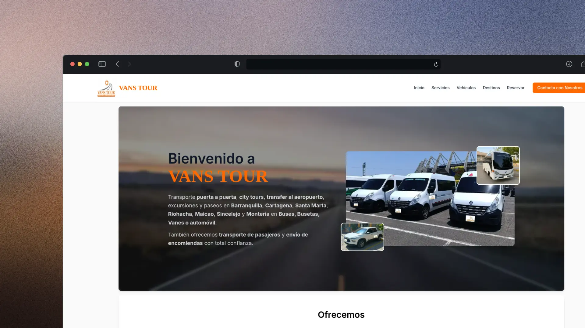
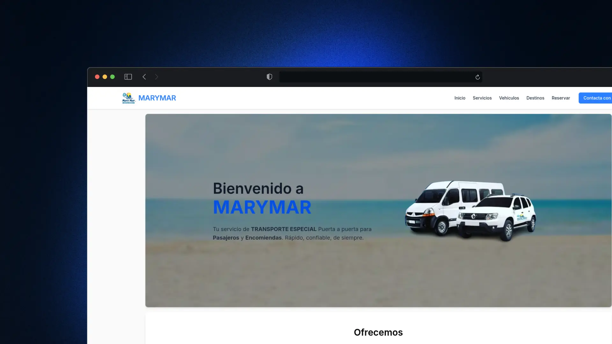

<h1 align="center">👋 Hey there! I'm Andres Araque</h1>

###

  <em>💻 Fullstack Developer | 🚀 Freelancer | 🌱 Lifelong Learner</em>

###

  
  
  

---

### 👨‍💻 About Me

Hi, I'm **Andres Stiven Araque** from Colombia 🇨🇴

- 🛠 Fullstack Developer with a passion for **building scalable, fast, and user-focused apps**.
- 🔭 Currently working as a **Software Analyst & Developer at Rappi**, while taking on **freelance projects** to keep challenging myself.
- 🌱 Always exploring **backend optimization, cloud architecture, and modern web technologies**.
- ⚡ Coffee, code, and constant learning – that's my fuel.

---

### 🛠 Tech Stack

#### 💻 Languages & Frameworks

#### 🗄️ Databases & Cloud

#### 🔧 Tools & Others

---

### 💼 Latest Freelance Projects

  <em>Some of my recent freelance works 🚀</em>

<table align="center">
  <tr>
    <td align="center" width="33%">
      
       
      <b>🚙 VansTour</b> 
      Astro | Tailwind CSS | JavaScript 
      <a href="https://www.vanstour.com.co/" target="_blank">🔗 Preview</a>
    </td>
    <td align="center" width="33%">
      
       
      <b>📦 MaryMar</b> 
      Astro | TailwindCSS | JavaScript 
      <a href="https://www.marymarsas.com/" target="_blank">🔗 Preview</a>
    </td>
  </tr>
</table>

  If you want to see more of my projects, visit my 
  <a href="https://andresaraque.com" target="_blank">portfolio</a>

---

### 📊 GitHub Stats

<table align="center">
  <tr>
    <td align="center" width="50%">

  
    </td>
    <td align="center" width='50%'>

  
    </td>
  </tr>
</table>

---

### 👀 Profile Views

